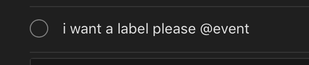
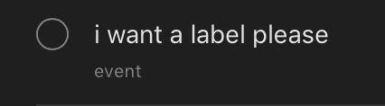

# labelist

For context: [Todoist](https://todoist.com) is a to-do manager that has
its very nice [labels](https://get.todoist.help/hc/en-us/articles/205195042-Labels)
feature behind a paywall.

I feel a little bad for doing this but it turns out that the
[Todoist REST API](https://developer.todoist.com/rest/v1/#update-a-task) allows
you to add labels to your tasks, regardless of whether or not you actually have
premium. So this serverless just receives webhooks for task creation/update and
then attaches labels via the API.

This will probably stop working at some point, but it seems to have been like
this for quite a while. I imagine integrations might depend on this too, so I
might be safe for the time being.

## Example

Create a wanna-be-labelled task with your free Todoist account:



With the function deployed, a few seconds later:



## Setup

I have this deployed using [Zeit Now](https://zeit.co). To get the webhooks,
you'll need to set up a [Todoist application](https://developer.todoist.com/appconsole.html).

1. Create a [Todoist application](https://developer.todoist.com/appconsole.html).
2. Get an [API token for your Todoist account](https://todoist.com/prefs/integrations).
3. Create an account in [Zeit Now](https://zeit.co) and download the [CLI](https://github.com/zeit/now).
4. Set the token in Now:

```sh
now secrets add todoist_api_token $MY_TOKEN
```

5. Deploy the function:

```sh
npm run deploy
```

6. Find the alias address (probably looks something like `labelist.bobheadxi.now.sh`)
  in the Zeit Now UI, and the webhook endpoint `$ZEIT_ADDR/api/hooks` to your
  [Todoist application](https://developer.todoist.com/appconsole.html) under
  "webhooks".
